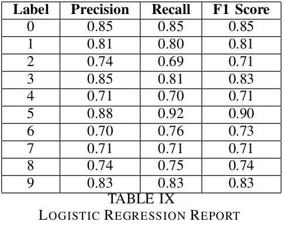
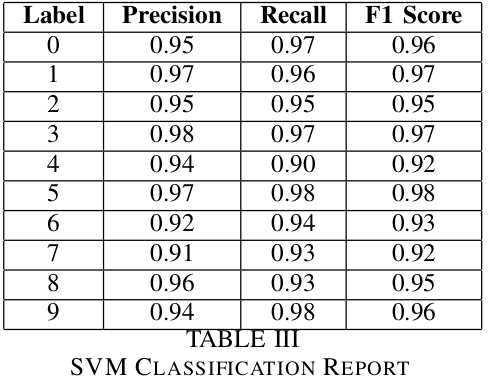

# Identification of Digits from sign languages 

##

## 
##

José Santos, 98279
Henrique Sousa, 98324

--- 
# Introduction
- Can be useful for:
  - Improving communication between hearing and non-hearing individuals; 
  - New technologies for the deaf and hard-of-hearing community.
- Different models were trained with a  dataset from Kaggle and their performance was compared.
- Studied impact of some preprocessing techniques.

---

# Data
- Original dataset has 2062 images
- Includes all numbers from 0 to 9
- Balanced dataset with similar number of examples for each label

---
# Data Preprocessing
## Image Augmentation

- We created 5 variations of each image by randomnly:
  - Rotating from -20 to 20 degrees
  - Adding Gaussian noise
  - Changing the gamma contrast by a random factor

---
# Data Preprocessing
## Image processing
- Resize image to 50x50
- Convert it to grayscale
- Flatten the images

## Training and Testing data
- Training data: 80% of the augmented dataset
- Testing data: 20% of the augmented dataset

---
# Models
- Initial run with default parameters: 

  <table>
    <thead>
      <tr>
        <th>Model</th>
        <th>Accuracy</th>
        <th>F1 score</th>
      </tr>
    </thead>
    <tbody>
      <tr>
        <td>Multilayer Perceptron Classifier</td>
        <td>0.092</td>
        <td>0.015</td>
      </tr>
      <tr>
        <td>Naive Bayes</td>
        <td>0.502</td>
        <td>0.506</td>
      </tr>
      <tr>
        <td>Decision Tree Classifier</td>
        <td>0.631</td>
        <td>0.632</td>
      </tr>
      <tr>
        <td>Logistic Regression</td>
        <td>0.750</td>
        <td>0.749</td>
      </tr>
      <tr>
        <td>Random Forest Classifier</td>
        <td>0.876</td>
        <td>0.876</td>
      </tr>
      <tr>
        <td>Support Vector Machines</td>
        <td>0.888</td>
        <td>0.888</td>
      </tr>
    </tbody>
  </table>

--- 

# Hyperparameter Tuning & Cross-Validation
We tried to find the optimal parameters for our case for the following Machine Learning models:
- Support Vector Machines
- Random Forest Classifier
- Logistic Regression
- Multilayer Perceptron Classifier

---
# Multilayer Perceptron
- Initial Accuracy of 9.2% and F1 Score of 1.5%

---
# Multilayer Perceptron
- Final Accuracy and F1 Score of 0,77
- Increase of ~739.13%

     

          
     

     

          
     

---

# Logistic Regression
- Initial Accuracy and F1 Score of 75%

---

# Logistic Regression
- Final Accuracy and F1 Score of 0,78
- Increase of ~4%

     

          
     

     

          
     

---

# Random Forest Classifier
- Initial Accuracy and F1 Score of 87,6%

---

# Random Forest Classifier
- Final Accuracy and F1 Score of 0.89
- Increase of ~1,7%

     

          
     

     

          
     

--- 
# Support Vector Machines
- Initial Accuracy and F1 Score of 88,8%

---

# Support Vector Machines
- Final Accuracy and F1 Score of 0.95
- Increase of ~6,7%

     

          
     

     

          
     

--- 
# Model Comparison
- Support Vector Machines achieved highest accuracy with 95.0%
- Random Forest followed with 89.1%
- Logistic Regression achieved 78.0%
- Multilayer Perceptron achieved 77.3%

---

# Original vs Augmented Dataset
- In the graph below we can see the difference in performance by using the original dataset and the augmented one

---
# Novelty and Contribution
- We focused on identifying all 10 digits while most notebooks we found only focused on two digits
  - Made it difficult to compare performances
- Pavan's notebook on automated hyperparameter tuning helped us decide the better way to find the optimal parameters
- Aleju's imgaug presented a simple and easy-to-use python library for generating additional images

---

# Conclusion
- Support Vector Machine was the best performing model for this task
- We were able to achieve a good performance with our changes
- Most important aspect of these tests is the use of good data  
- Image augmentation is extremely important for these kind of problems when dealing with small datasets
