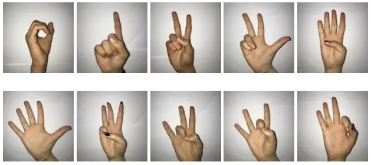
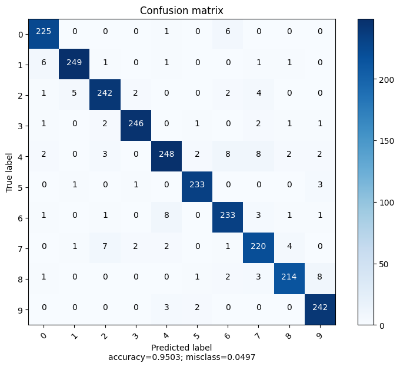
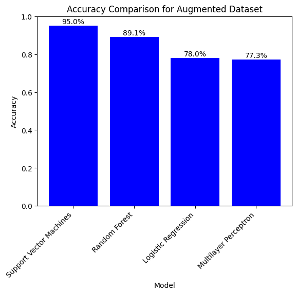

# Identification of Digits from sign languages 

---

# Data 
- Use of 2062 images as a database, provided by Kaggle 
- Data includes all numbers from 0 to 9 with 10 labels 
- Use of Raw image data due to easier manipulation

---
# Data Preprocessing

- Changes preformed randomly:
  - rotate(-20º to 20º)
  - Gausian noise (0 to 0.05*255)
  - Gamma contrast(0.5 to 1.5)

With this changes for every image five new ones were made

---

# Image processing
- Use of images that were grayscale and flattened showed better results
- Split the dataset into training and testing 
![bg right:40% 95%]

---
# Models 
**model** | **Accuracy** | **F1 score**
:--|:--:|:--:|
Logistic regression |0.750 | 0.749
Decision Three Classifier | 0.631 |0.632
Random Forest Classifier |0.876|0.876
Naive Bayes |0.502|0.506
Support Vector Machines|0.888|0.888
Multilayer Perceptrion classifier|0.092|0.015

--- 

# hyperparameter tuning & cross-validation

---
# Support Vector machine

- Best performing model for the classification task.
- 88% Accuracy and F1 Score
- Best performing parameters
  - C=100
  - kernel=rbf
  - degree=2
  - gamma=scale

---

# Random Forest Classifier
- Second best model
- 88% Accuracy and F1 Score
- Best performing parameters
  - n_estimators=500
  - criterion=entropy
  - max_depth=None
  - min_samples_split=2
  - min_samples_leaf=1
  - max_features=auto

---
# Multilayer Perceptron
- Worst results of all tests
- 9.2% Accuracy and 1.5% F1 Score
- Best performing parameters
  - solver=lbfgs
  - max iter = 1000
  - hidden layer sizes = (256, 512, 128)
  - activation = relu
  - alpha = 0.0001
  - learning rate = adaptive
  - learning rate init = 0.001

---
# Logistic Regression
- 75% Accuracy and 74.9% F1 Score 
- Best performing parameters
  - solver 
  - max iter = 1000
  - C = 10
  - class weight = balanced
  - penalty = l2

--- 

 

---
# Conclusion
- Support Vector Machine is the best performing model for this task
- Most important aspect of these tests is the use of good data  

