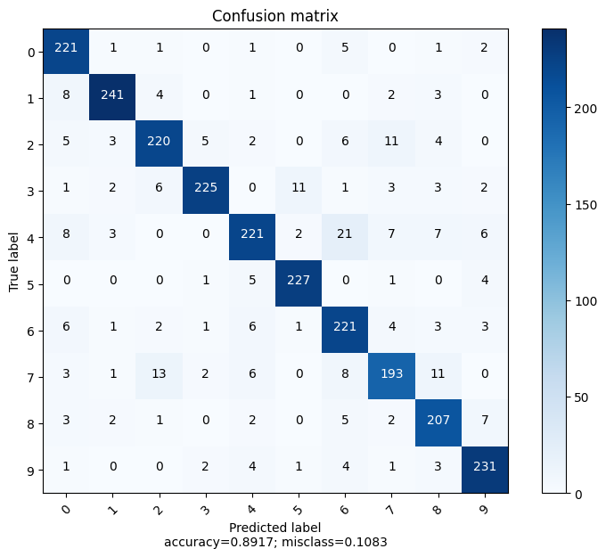

# Identification of Digits from sign languages 

--- 
# Introduction
- Can be useful for:
  - improving communication between hearing and non-hearing individuals; 
  - Starting point for new technologies for the deaf and hard-of-hearing community.
- Different models (neural networks, support vector machines, decision trees) were tested and their performance was compared on a sign language image dataset from Kaggle.
- Studied impact of some preprocessing techniques.

---

# Data
- Original dataset has 2062 images
- Includes all numbers from 0 to 9 with 10 labels
- Balanced dataset with similar number of examples for each label

---
# Data Preprocessing
## Image Augmentation

- We created 5 variations of each image by randomnly:
  - Rotating from -20 to 20 degrees
  - Adding Gaussian noise
  - Changing the gamma contrast by a random factor

---
# Data Preprocessing
## Image processing
- Resize image to 50x50
- Convert it to grayscale
- Flatten the images

## Training and Testing data
- Training data: 80% of the original dataset
- Testing data: 20% of the augmented dataset

---
# Models
Initial run with default parameters: 
| **Model**                        | **Accuracy** | **F1 score** |
|---------------------------------|:------------:|:------------:|
| Multilayer Perceptron Classifier|    0.092     |    0.015     |
| Naive Bayes                     |    0.502     |    0.506     |
| Decision Tree Classifier        |    0.631     |    0.632     |
| Logistic Regression             |    0.750     |    0.749     |
| Random Forest Classifier        |    0.876     |    0.876     |
| Support Vector Machines         |    0.888     |    0.888     |

--- 

# Hyperparameter Tuning & Cross-Validation
We tried to find the optimal parameters for our case for the following Machine Learning models:
- Support Vector Machines
- Random Forest Classifier
- Logistic Regression
- Multilayer Perceptron Classifier

---
# Multilayer Perceptron
- 9.2% Accuracy and 1.5% F1 Score
- Best performing parameters
  - solver = lbfgs
  - max iter = 1000
  - hidden layer sizes = (256, 512, 128)
  - activation = relu
  - alpha = 0.0001
  - learning rate = adaptive
  - learning rate init = 0.001

---

# Logistic Regression
- 75% Accuracy and 74.9% F1 Score 
- Best performing parameters
  - solver 
  - max iter = 1000
  - C = 10
  - class weight = balanced
  - penalty = l2

---

# Random Forest Classifier
- Second best model
- 88% Accuracy and F1 Score
- Best performing parameters
  - n_estimators=500
  - criterion=entropy
  - max_depth=None
  - min_samples_split=2
  - min_samples_leaf=1
  - max_features=auto

--- 
# Support Vector machine

- Best performing model for the classification task.
- 88% Accuracy and F1 Score
- Best performing parameters
  - C=100
  - kernel=rbf
  - degree=2
  - gamma=scale

---

 

---
# Conclusion
- Support Vector Machine is the best performing model for this task
- Most important aspect of these tests is the use of good data  

